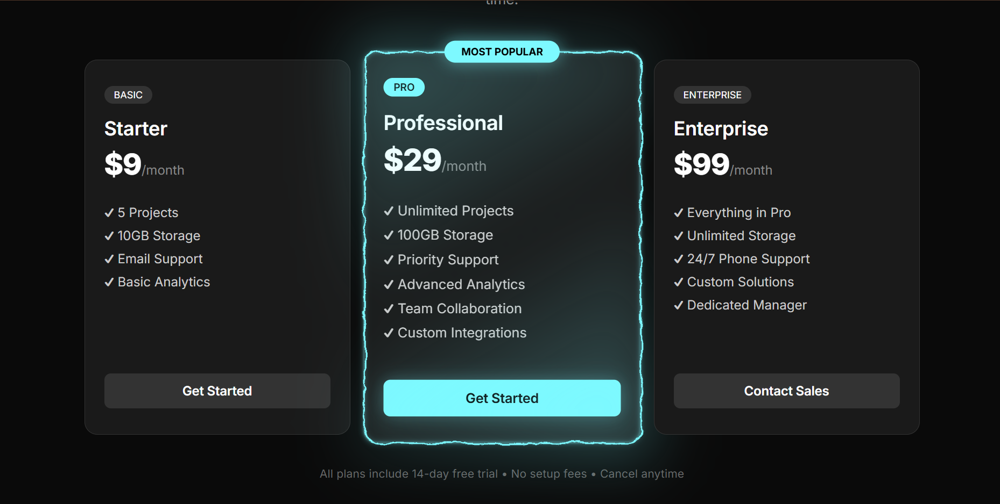
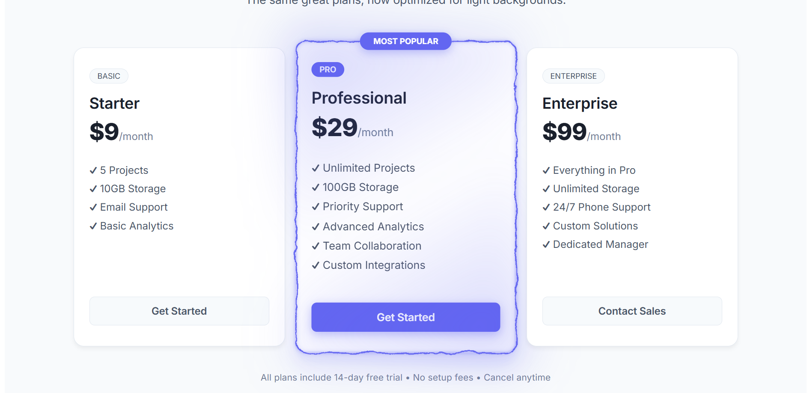

# ⚡ Electric Pricing Cards

Stunning React pricing cards with animated electric borders that grab attention and drive conversions. Perfect for highlighting featured plans in your SaaS or product pricing page.

## 🎬 Live Preview


*Dark mode with cyan electric border*


*Light mode with indigo electric border*

## ✨ Features

- 🎯 **Attention-grabbing**: Electric border animation draws focus to featured pricing plans
- 🌓 **Dual theme support**: Beautiful dark and light mode versions included
- ⚡ **Fully customizable**: Adjust color, speed, chaos level, and thickness
- 📱 **Responsive design**: Works perfectly across all device sizes
- 🎨 **Professional typography**: Uses Inter font for modern, clean look
- 🚀 **Performance optimized**: Uses ResizeObserver and requestAnimationFrame
- 📦 **Easy to integrate**: Simple copy-paste implementation
- 💎 **Production ready**: TypeScript support with proper typing

## 🚀 Quick Start

### Option 1: Direct Download (Recommended)

1. **Download the component files:**
   - Copy [`ElectricBorder.tsx`](./ElectricBorder.tsx)
   - Copy [`ElectricBorder.css`](./ElectricBorder.css)

2. **Install React (if needed):**
```bash
npm install react @types/react
```

3. **Import and use:**
```tsx
import ElectricBorder from './ElectricBorder';
import './ElectricBorder.css';

function PricingCard() {
  return (
    <ElectricBorder
      color="#7df9ff"
      speed={1.2}
      chaos={0.3}
      thickness={2}
      style={{ borderRadius: 16 }}
    >
      <div style={{ padding: '32px', background: '#1a1a1a' }}>
        <h3>Pro Plan</h3>
        <p>$29/month</p>
        <button>Get Started</button>
      </div>
    </ElectricBorder>
  );
}
```

### Option 2: Clone Full Project

```bash
git clone https://github.com/yourusername/Electric-pricing-cards.git
cd Electric-pricing-cards
npm install
npm run dev
```

Visit `http://localhost:5173` to see the full demo with both dark and light modes.

## 🎛️ Component Props

| Prop | Type | Default | Description |
|------|------|---------|-------------|
| `color` | `string` | `"#5227FF"` | Electric border color (any CSS color) |
| `speed` | `number` | `1` | Animation speed multiplier (0.1-3 recommended) |
| `chaos` | `number` | `1` | Distortion intensity (0 = smooth, 2+ = very chaotic) |
| `thickness` | `number` | `2` | Border thickness in pixels |
| `className` | `string` | - | Additional CSS class names |
| `style` | `CSSProperties` | - | Inline styles (borderRadius, etc.) |
| `children` | `ReactNode` | - | Content to wrap with electric border |

## 🎨 Color Recommendations

```tsx
// Dark Mode Colors
<ElectricBorder color="#7df9ff" />  // Cyan (featured)
<ElectricBorder color="#0ea5e9" />  // Sky blue
<ElectricBorder color="#8b5cf6" />  // Violet

// Light Mode Colors  
<ElectricBorder color="#6366f1" />  // Indigo (featured)
<ElectricBorder color="#0891b2" />  // Cyan
<ElectricBorder color="#7c3aed" />  // Purple
```

## 💡 Usage Examples

### Basic Pricing Card
```tsx
<ElectricBorder color="#7df9ff" style={{ borderRadius: 12 }}>
  <div className="pricing-card">
    <span className="badge">PRO</span>
    <h3>Professional</h3>
    <div className="price">$29<span>/month</span></div>
    <ul className="features">
      <li>✓ Unlimited Projects</li>
      <li>✓ Priority Support</li>
    </ul>
    <button className="cta-button">Get Started</button>
  </div>
</ElectricBorder>
```

### Featured Card with Badge
```tsx
<div style={{ position: 'relative', transform: 'scale(1.05)' }}>
  <div className="most-popular-badge">MOST POPULAR</div>
  <ElectricBorder 
    color="#7df9ff" 
    speed={1.2} 
    chaos={0.3}
    style={{ borderRadius: 16 }}
  >
    <div className="featured-card">
      {/* Your card content */}
    </div>
  </ElectricBorder>
</div>
```

### Light Mode Implementation
```tsx
<ElectricBorder
  color="#6366f1"
  speed={1}
  chaos={0.3}
  thickness={2}
  style={{ borderRadius: 16 }}
>
  <div style={{ 
    padding: '32px',
    background: '#ffffff',
    boxShadow: '0 20px 25px rgba(99, 102, 241, 0.1)'
  }}>
    {/* Light theme card content */}
  </div>
</ElectricBorder>
```

## 🎯 Best Practices

### Performance Tips
- **Limit usage**: Use on 1-2 cards maximum per page
- **Mobile optimization**: Reduce `chaos` and `speed` on mobile devices
- **Test performance**: Always test on lower-end devices

### Design Guidelines
- **Contrast**: Ensure good contrast between border and background
- **Hierarchy**: Reserve electric border for your most important card
- **Brand consistency**: Match electric color with your brand palette

### Accessibility
- **Motion sensitivity**: Consider `prefers-reduced-motion` CSS media query
- **Color contrast**: Maintain readable text with glowing effects
- **Focus management**: Preserve keyboard navigation focus states

## 🔧 Customization Examples

### Smooth Border (No Chaos)
```tsx
<ElectricBorder chaos={0} speed={0.8} color="#7df9ff" />
```

### High Energy Effect
```tsx
<ElectricBorder chaos={1.5} speed={2} thickness={3} color="#ff6b35" />
```

### Subtle Professional Look
```tsx
<ElectricBorder chaos={0.2} speed={0.6} thickness={1} color="#6366f1" />
```

## 🛠️ Technical Implementation

### How It Works
- **SVG Filters**: Uses `feTurbulence` and `feDisplacementMap` for electric distortion
- **CSS Custom Properties**: Dynamic color and size management
- **ResizeObserver**: Responsive animations that adapt to container changes
- **RequestAnimationFrame**: Smooth, performance-optimized animations

### Browser Support
- ✅ Chrome/Edge 76+
- ✅ Firefox 72+  
- ✅ Safari 13+
- ✅ Mobile browsers (iOS Safari 13+, Chrome Android 76+)

### Requirements
- React 16.8+ (hooks support)
- Modern browser with SVG filter support
- TypeScript (optional but recommended)

## 📁 Project Structure

```
Electric-pricing-cards/
├── ElectricBorder.tsx          # Main component
├── ElectricBorder.css          # Component styles
├── App.tsx                     # Demo application
├── main.tsx                    # React entry point
├── index.html                  # HTML template
├── screenshots/                # Preview images
├── package.json               # Dependencies
├── vite.config.ts            # Build configuration
├── tsconfig.json             # TypeScript config
└── README.md                 # This file
```

## 🚀 Development

```bash
# Install dependencies
npm install

# Start development server
npm run dev

# Build for production
npm run build

# Preview production build
npm run preview
```

## 🤝 Contributing

Contributions are welcome! Please read our [Contributing Guidelines](CONTRIBUTING.md) for details.

1. Fork the repository
2. Create your feature branch (`git checkout -b feature/amazing-feature`)
3. Commit your changes (`git commit -m 'Add amazing feature'`)
4. Push to the branch (`git push origin feature/amazing-feature`)
5. Open a Pull Request

## 📝 License

This project is licensed under the MIT License - see the [LICENSE](LICENSE) file for details.

## 🙏 Acknowledgments

- Electric border effect inspired by [@BalintFerenczy](https://codepen.io/BalintFerenczy/pen/KwdoyEN)
- Built with React, TypeScript, and Vite
- Typography uses [Inter](https://fonts.google.com/specimen/Inter) font family

## ⭐ Show Your Support

If this project helped you, please give it a ⭐️ on GitHub!

---

**Built with ⚡ and React** | [Live Demo](https://yourusername.github.io/Electric-pricing-cards) | [Issues](https://github.com/yourusername/Electric-pricing-cards/issues)